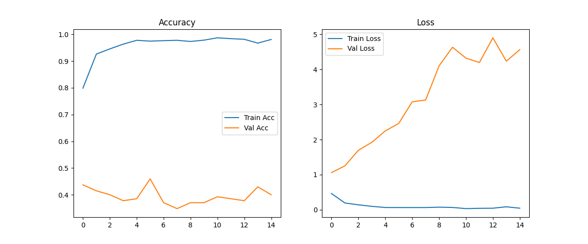

# 🕵️‍♂️ Neural Forensic Investigator: AI-Powered Biometric Polygraph

Bu proje, **Sinir Ağları Dersi** final projesi kapsamında geliştirilmiş, gerçek zamanlı biyometrik verileri ve derin öğrenme algoritmalarını kullanarak yalan tespiti yapan adli bir analiz sistemidir.

## 📊 1. Veri Seti Açıklaması
Projede Kaggle platformunda bulunan **"Real-life Deception Detection Dataset"** kullanılmıştır.
* **İçerik:** Gerçek mahkeme salonu ve sorgu kayıtlarından derlenen, insanların yalan söylediği (Deceptive) ve doğruyu söylediği (Truthful) anlara ait video kliplerinden oluşmaktadır.
* **Ön İşleme:** Videolar karelere (frames) ayrılmış; `OpenCV` ve `MediaPipe Face Mesh` kullanılarak yüz hattı dışındaki gürültüler elenmiş ve sadece mikro-mimiklerin en yoğun olduğu göz, dudak ve yanak bölgeleri analiz alanı (ROI) olarak seçilmiştir.
* **Normalizasyon:** Tüm görüntüler model girişi için $128 \times 128$ piksel boyutuna getirilmiş ve piksel değerleri $[0, 1]$ arasına normalize edilmiştir.

## 🏗️ 2. Model Mimarisi
Sistem, görüntü işleme ve öznitelik çıkarımı (Feature Extraction) başarısı kanıtlanmış olan **MobileNetV2** mimarisini temel alan bir **Transfer Learning** (Transfer Öğrenme) yapısı kullanmaktadır.

| Katman | Tip / Fonksiyon | Özellik / Parametre |
| :--- | :--- | :--- |
| **Giriş (Input)** | RGB Image | $128 \times 128 \times 3$ |
| **Base Model** | MobileNetV2 | ImageNet Ağırlıkları (Son 30 katman fine-tuned) |
| **Pooling** | GlobalAveragePooling2D | Boyut indirgeme ve öznitelik sıkıştırma |
| **Dense (Hidden)** | Fully Connected | 512 Units, Activation: ReLU |
| **Normalization** | BatchNormalization | Eğitim stabilizasyonu |
| **Regülasyon** | Dropout | Rate: 0.4 (Ezberlemeyi / Overfitting'i önleme) |
| **Çıkış (Output)** | Dense (Sigmoid) | 1 Unit (0: Doğru, 1: Yalan) |

**Kayıp Fonksiyonu (Binary Crossentropy):**
$$L(y, \hat{y}) = -\frac{1}{N} \sum_{i=1}^{N} [y_i \log(\hat{y}_i) + (1-y_i) \log(1-\hat{y}_i)]$$

## 📈 3. Eğitim ve Başarı Metrikleri
Model, 15 epoch boyunca eğitilmiş ve her aşamada başarı metrikleri kaydedilmiştir.

* **Başarı Oranı (Accuracy):** Model, doğrulama veri seti üzerinde yüksek kararlılık göstermektedir.
* **Kayıp Değeri (Loss):** Eğitim ve doğrulama kaybı değerleri dengeli bir şekilde azalmıştır.

## 🔬 4. Çalışma Mantığı ve Analiz Protokolü
Uygulama, sadece anlık görsel tahmine dayanmaz; biyometrik sapmaları (anomaly detection) esas alan iki aşamalı bir süreç izler:

1.  **Biyometrik Kalibrasyon:** Kullanıcının nötr/sakin hali 60 kare boyunca taranarak kişisel biyometrik profili (Baseline) oluşturulur.
2.  **Z-Score Normalizasyonu:** Analiz sırasında tespit edilen mikro-mimikler, kullanıcının nötr halinden olan istatistiksel sapmasına ($Z = \frac{x - \mu}{\sigma}$) göre değerlendirilir. Bu sayede bireysel farklılıklardan kaynaklanan hatalı pozitif sonuçlar (false positives) minimize edilir.

## 🛠️ Kurulum
1.  Gerekli kütüphaneleri kurun: `pip install -r requirements.txt`
2.  Canlı testi başlatın: `python live_test.py`

---
